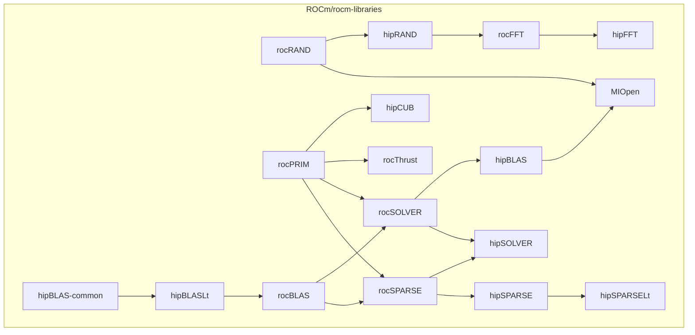

# Continuous Integration

> [!IMPORTANT]
> This document is currently in **draft** and may be subject to change.

This document is to detail the various continuous integration (CI) systems that are run on the rocm-libraries monorepo.

## Table of Contents
- [Continuous Integration](#continuous-integration)
  - [Table of Contents](#table-of-contents)
  - [Azure Pipelines](#azure-pipelines)
    - [Overview ](#overview-)
    - [PR Workflow ](#pr-workflow-)
    - [Build and Test Coverage ](#build-and-test-coverage-)
    - [Downstream Job Triggers ](#downstream-job-triggers-)
  - [Math CI](#math-ci)
    - [Overview ](#overview--1)
  - [Windows CI](#windows-ci)
    - [Overview ](#overview--2)
  - [TheRock CI](#therock-ci)
    - [Overview ](#overview--3)

## Azure Pipelines

### Overview 

The ROCm Azure Pipelines CI (also known as External CI) is a public-facing CI system that builds and tests against latest public source code. It encompasses almost all of the ROCm stack, typically pulling source code from the `develop` or `amd-staging` branch on a component's GitHub repository. The CI's main source is publically available at [ROCm/ROCm/.azuredevops](https://github.com/ROCm/ROCm/tree/develop/.azuredevops).

See the [Azure monorepo dashboard](https://dev.azure.com/ROCm-CI/ROCm-CI/_build?definitionScope=%5Cmonorepo) for a full list of pipelines running in the monorepo.

For commits to trunk, the pipelines will run based on the conditions defined in the trigger files under [/.azuredevops](https://github.com/ROCm/rocm-libraries/tree/develop/.azuredevops).

For PRs targeting trunk, the [`Trigger Azure CI`](https://github.com/ROCm/rocm-libraries/blob/develop/.github/workflows/azure-ci-dispatcher.yml) GitHub Action will be run, which will analyze a PR's changed files and run CI for the appropriate components. The final CI status will be reflected in an `Azure CI Summary` check.

### PR Workflow 

1. PR is submitted
2. `Trigger Azure CI` action is run on the PR
    1. Analyzes the PR's contents, determines which pipelines to run
    2. Sends request(s) to Azure API to start runs
    3. Creates a new `Azure CI Summary` check on the PR, which is a gating requirement
3. Azure CI builds and tests the PR against latest public source code
4. As runs finish, they will update `Azure CI Summary` with their status
    - If all runs are passing, `Azure CI Summary` is marked as passing
    - If any runs have failed, `Azure CI Summary` is marked as failing and the PR is blocked from merging

Clicking on the `Azure CI Summary` check on a PR will bring up information such as the individual runs triggered, the merge SHA used, and instructions on requesting CI reruns.

From a summary page, clicking on a run ID will bring you to the run's Azure page, where build and test logs can be found. Any errors or warnings will be prominently displayed on this page.

### Build and Test Coverage 

Azure CI builds and tests primarily on Ubuntu 22.04 LTS and for `gfx942` and `gfx90a` architectures, and adding build support for more architectures and operating systems is in progress.

Build coverage:
| | Ubuntu 22.04 | Almalinux 8 |
|-|-|-|
| **gfx942** | ✅ Supported | ✅ Supported |
| **gfx90a** | ✅ Supported | ✅ Supported |
| **gfx1201** | 🚧 In progress | 🚧 In progress |
| **gfx1100** | 🚧 In progress | 🚧 In progress |
| **gfx1030** | 🚧 In progress | 🚧 In progress |

Test coverage:
| | Ubuntu 22.04 | Almalinux 8 |
|-|-|-|
| **gfx942** | ✅ Supported | ❌ Unsupported |
| **gfx90a** | ✅ Supported | ❌ Unsupported |
| **gfx1201** | ❌ Unsupported | ❌ Unsupported |
| **gfx1100** | ❌ Unsupported | ❌ Unsupported |
| **gfx1030** | ❌ Unsupported | ❌ Unsupported |

For testing, the majority of components use `ctest` or `gtest`. Component-specific details such as build flags and test configurations can be viewed in a component's main pipeline file in [ROCm/ROCm/.azuredevops/components](https://github.com/ROCm/ROCm/tree/develop/.azuredevops/components).

### Downstream Job Triggers 

Azure CI runs for a component will trigger runs for downstream components (provided that they are fully migrated onto the monorepo). The end goal is to catch upstream breaking changes before they are merged and to ensure the monorepo is always in a valid state.

For example: a rocPRIM PR will trigger a rocPRIM job. If successful, it will then continue to run hipCUB and rocThrust jobs.

The following graph illustrates the inter-component dependencies within the mathlibs stack:

## Math CI

### Overview 

## Windows CI

### Overview 

## TheRock CI

### Overview 

TheRock CI runs Linux and Windows builds and tests for nightly jobs, pushes to develop, pull requests and workflow dispatches.

TheRock CI builds using `rocm-libraries` at HEAD with TheRock build system. For testing, we test using TheRock's [`fetch_test_configurations.py`](https://github.com/ROCm/TheRock/blob/main/build_tools/github_actions/fetch_test_configurations.py) along with [ROCm test machines](https://github.com/ROCm/TheRock/blob/main/build_tools/github_actions/amdgpu_family_matrix.py).

For pull requests and pushes to `develop`:
- If a change is made to `.github/workflows/therock-*` or `.github/scripts/therock-*`, all projects are built and smoke tests are run.
- If a change is made to `projects/*` or `shared/*`, TheRock CI will determine which subtree has changed and run the corresponding builds and full tests, using [`therock_matrix.py`](../.github/scripts/therock_matrix.py)

For nightly jobs, TheRock CI runs all builds and full tests for all projects from [`therock_matrix.py`](../.github/scripts/therock_matrix.py).

For workflow dispatch triggers, TheRock CI will run builds and full tests for whichever projects are specified.
