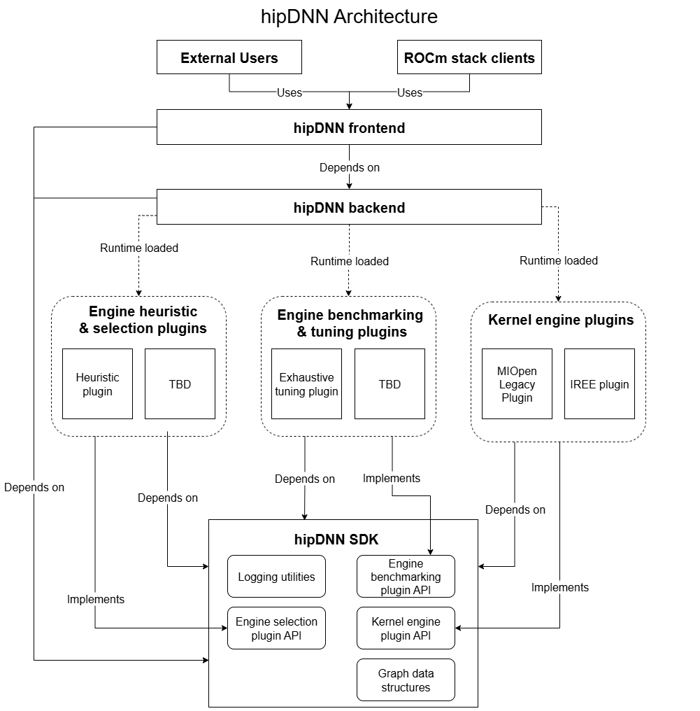

# hipDNN Design

> [!NOTE]
> 📝 We are in an early stage of development for hipDNN. This design is subject to change.

hipDNN is a graph-based deep learning library that enables multi-operation fusion for improved performance on AMD GPUs. It uses operation graphs as an intermediate representation to describe computations, allowing different backend engines to optimize and execute these graphs efficiently.

## Core Design Principles

- **Graph-based API**: Operations are expressed as computational graphs rather than individual function calls, enabling optimization opportunities
- **Plugin Architecture**: Backend engines, heuristics, and benchmarking are implemented as plugins, allowing extensibility without modifying the core library
- **Performance through Fusion**: Multiple operations can be fused into single kernels for better performance
- **Engine Selection**: Heuristics and benchmarking will be implemented as plugins, allowing extensibility without modifying the core library
- **Industry Standard API**: Provides a familiar interface that matches established deep learning library conventions

## High-Level Architecture 

hipDNN has a plugin-based architecture in order to allow contributors and users to extend hipDNN without modifying the core library. Currently, hipDNN has support for engine plugins which provide the kernels to solve graphs. In the future hipDNN will support both heuristic and benchmarking plugins to allow for improved engine selection. Benchmarking plugins will provide exhaustive tuning capabilities, but will require collecting samples from existing engines to do so. Heuristic plugins will provide better default engine selection given a graph, and shouldn't require collecting samples from existing engines to do so.



### Components
**Frontend**: A header-only C++ library that provides the industry standard API for interacting with hipDNN. The frontend wraps the backend C API to provide a more user-friendly C++ interface.

**Backend**: A shared library which provides a C API for hipDNN. The backend is the core component of hipDNN which acts as a plugin loader and manager, connecting problems to plugins that can solve them.

**SDK**: A header-only library that provides shared utilities and interfaces that plugins, frontend, and backend depend on to ensure compatibility and communication.

**MIOpen Legacy Plugin**: A plugin that wraps MIOpen and provides access to the existing API through hipDNN. In the future, the MIOpen Legacy Plugin will be its own separate project separate from hipDNN.

**Other Plugins**: Plugins will be added over time to provide additional operational support, or performance improvements. Plugins should be external projects to hipDNN.

## Component Details

### SDK

The SDK is a header-only library that serves as the foundation for communication between different hipDNN components.

#### Key Characteristics
- **Header-only**: No compiled libraries, simplifying integration
- **Dependencies**: Flatbuffers and spdlog
- **Purpose**: Provides shared utilities and interfaces between Frontend, Backend, and Plugins
- **Expected Usage**: Consumed as a header-only dependency in user projects, and plugin projects

#### Core Functionality
- **Plugin APIs**: Defines the interface that engine plugins must implement (e.g., `hipdnnEnginePluginCreate`, `hipdnnEnginePluginExecuteOpGraph`)
- **Data Objects**: Flatbuffer-based data structures for graphs, tensors, and engine configurations
- **Verification Utilities**: Tools for validating solutions and ensuring correctness
- **Logging Utilities**: Consistent logging infrastructure across all components
- **Type Helpers**: Utilities for working with different data types (half, bfloat16, etc.)

For the SDK development roadmap and planned features, see the [SDK section in the Roadmap](./Roadmap.md#sdk).

### Frontend

The Frontend provides a user-friendly C++ interface to hipDNN, wrapping the lower-level C API provided by the Backend.

#### Key Characteristics
- **Header-only C++ library**: No compiled libraries, simplifying integration
- **Dependencies**: Backend, and SDK
- **Purpose**: Provides easy to use API for accessing hipDNN backend
- **Expected Usage**: Consumed as a header-only dependency in user projects

#### Architecture Overview

##### Graph Class
The central abstraction in the Frontend is the `Graph` class, which:
- Manages the construction of operation graphs
- Handles the creation and configuration of nodes
- Orchestrates the execution workflow

##### Nodes
Nodes represent individual operations within a graph:
- Each node type (e.g., `BatchnormNode`, `PointwiseNode`) inherits from `INode`
- Nodes encapsulate their specific attributes and tensor connections
- Support serialization to Flatbuffer format for Backend consumption

##### Attributes
Attributes configure the behavior of nodes:
- Each node type has corresponding attribute classes (e.g., `Batchnorm_attributes`)
- Attributes include operation-specific parameters like epsilon, momentum, etc.
- Support builder pattern for easy configuration

#### Simplified Workflow Example
```cpp
// Create a graph
Graph graph;
graph.set_compute_data_type(DataType_t::FLOAT);

// Create tensors
auto x = Graph::tensor(/* tensor attributes */);
auto scale = Graph::tensor(/* tensor attributes */);
auto bias = Graph::tensor(/* tensor attributes */);

// Add operations
auto [y, mean, inv_var, _, _] = graph.batchnorm(x, scale, bias, bn_attributes);

// Build and execute
graph.build_operation_graph(handle);
graph.create_execution_plans();
graph.build_plans();
graph.execute(handle, variant_pack, workspace);
```

For complete working examples, see the official [samples](../samples/).

### Backend

The Backend is the core engine of hipDNN, responsible for managing plugins and orchestrating graph execution.

#### Key Characteristics
- **Installable library**: C API with ABI for language interoperability, dynamically loadable
- **Dependencies**: SDK
- **Purpose**: Provides a stable graph based API for describing kernel fusions
- **Expected Usage**: Library linked to the frontend API and expert user projects that provides access to the hipDNN backend API

#### Descriptor Types

The Backend uses descriptors as opaque handles to manage different aspects of graph execution:

##### 1. Operation Graph Descriptor (`HIPDNN_BACKEND_OPERATIONGRAPH_DESCRIPTOR`)
- Represents the computational graph to be executed
- Contains nodes, tensors, and their connections
- Created from serialized Flatbuffer data

##### 2. Engine Heuristic Descriptor (`HIPDNN_BACKEND_ENGINEHEUR_DESCRIPTOR`)
- Manages the selection of appropriate engines for a graph
- Queries plugins for applicable engines
- Extensible plugin design to control engine selection

##### 3. Engine Config Descriptor (`HIPDNN_BACKEND_ENGINECFG_DESCRIPTOR`)
- Represents a specific engine configuration
- Contains engine ID and configuration parameters
- Retrieved from heuristic results

##### 4. Engine Descriptor (`HIPDNN_BACKEND_ENGINE_DESCRIPTOR`)
- Represents a backend engine
- Contains engine ID, and a set of behavioral notes + configurable settings
- Retrieved from engine config Descriptor

##### 5. Execution Plan Descriptor (`HIPDNN_BACKEND_EXECUTION_PLAN_DESCRIPTOR`)
- Combines an engine configuration with a graph
- Manages workspace requirements
- Prepares for actual execution

##### 6. Variant Pack Descriptor (`HIPDNN_BACKEND_VARIANT_PACK_DESCRIPTOR`)
- Contains runtime data for execution
- Maps tensor UIDs to device memory pointers
- Includes workspace device memory pointer

#### Expected Workflow

1. **Create a Graph**: Build an operation graph using Frontend
2. **Create Heuristic Descriptor**: Initialize with the graph and desired heuristic mode
3. **Get Engine Configs**: Query available engine configurations from the heuristic
4. **Create Execution Plan**: Combine selected engine config with the graph
5. **Run Execution Plan**: Execute with variant pack containing tensor data

```c
// Simplified Backend workflow
hipdnnBackendDescriptor_t graph_desc, heuristic_desc, config_desc, plan_desc, variant_desc;

// 1. Create graph (from serialized data)
hipdnnBackendCreateAndDeserializeGraph_ext(&graph_desc, serialized_graph, size);

// 2. Create and configure heuristic
hipdnnBackendCreateDescriptor(HIPDNN_BACKEND_ENGINEHEUR_DESCRIPTOR, &heuristic_desc);
hipdnnBackendSetAttribute(heuristic_desc, HIPDNN_ATTR_ENGINEHEUR_OPERATION_GRAPH, ...);
hipdnnBackendFinalize(heuristic_desc);

// 3. Get engine configurations
hipdnnBackendGetAttribute(heuristic_desc, HIPDNN_ATTR_ENGINEHEUR_RESULTS, ...);

// 4. Create execution plan
hipdnnBackendCreateDescriptor(HIPDNN_BACKEND_EXECUTION_PLAN_DESCRIPTOR, &plan_desc);
hipdnnBackendSetAttribute(plan_desc, HIPDNN_ATTR_EXECUTION_PLAN_ENGINE_CONFIG, ...);
hipdnnBackendFinalize(plan_desc);

// 5. Execute
hipdnnBackendExecute(handle, plan_desc, variant_desc);
```

For the backend development roadmap and planned features, see the [Backend section in the Roadmap](./Roadmap.md#backend).

### Engine Plugins

Engine plugins provide the actual computational implementations for hipDNN graphs.

#### Key Characteristics
- **Separate installable projects**: Independent development and deployment
- **Dependencies**: hipDNN SDK, (and plugin specific dependencies as needed)
- **Purpose**: Provides engines which are capable of solving graphs
- **Expected Usage**: Loaded at runtime by hipDNN backend

#### Plugin Architecture

##### Plugin Loading
- Backend discovers plugins at runtime via the default plugin path, or by using `hipdnnSetEnginePluginPaths_ext` to provide additional paths to load plugins from
- Each plugin exports standard entry points defined in the SDK

##### Engine Management
- Each plugin can provide multiple engines
- Engines must have globally unique IDs that remain constant run to run
- Plugins determine which engines are applicable for a given graph

##### Key Plugin Functions
```c
// Get all available engine IDs
hipdnnEnginePluginGetAllEngineIds(engine_ids, max_engines, num_engines);

// Check which engines can solve a graph
hipdnnEnginePluginGetApplicableEngineIds(handle, graph, engine_ids, max, num);

// Create execution context for a specific engine
hipdnnEnginePluginCreateExecutionContext(handle, config, graph, context);

// Execute the graph
hipdnnEnginePluginExecuteOpGraph(handle, context, workspace, buffers, num_buffers);
```

#### Engine Plugin Types

##### 1. Static Kernel Engines
- Provide pre-compiled kernels for specific operations
- Narrow support: Only handle specific configurations
- Example: MIOpen Legacy Plugin
- **Advantages:**
  - Highly optimized for supported cases
  - Predictable performance
  - Lower compilation overhead

##### 2. Dynamic Kernel Engines
- Generate kernels at runtime based on graph structure
- Broad support: Handle general graph patterns
- Example: Future JIT-compilation plugins
- **Advantages:**
  - Flexible operation fusion
  - Support for novel graph patterns
  - Adaptable to hardware capabilities

See [Plugin Development](./PluginDevelopment.md) for advanced information on developing and using plugins.
