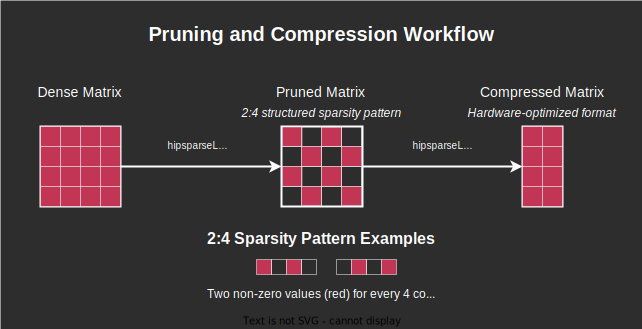

.. meta::
   :description: MI300 features for hipSPARSELt
   :keywords: hipSPARSELt, ROCm, MI300

.. _mi300-features:

**********************************************************************
hipSPARSELt features for the Instinct MI300 series
**********************************************************************

hipSPARSELt provides hardware acceleration support for sparse matrix multiplication operations
on AMD Instinct™ MI300 series GPUs using SMFMA (Sparse Matrix Fused Multiply Add) matrix instructions.

For hardware-accelerated sparse-dense matrix operations, the following conditions apply:

*  One matrix must be structurally sparse. Two out of every four elements on the K axis must be zero.
*  The other matrix must be dense.
*  The output matrix serves as the accumulation (destination) matrix.
*  The sparse indexes determine which two elements out of every four are non-zero, where for each index pair,
   ``index0 < index1`` and ``index0 != index1``.

Data types and precision
========================

While the Instinct MI300 series supports multiple data types for hardware-accelerated sparse matrix operations,
the hipSPARSELt library currently enables hardware acceleration for a subset of these types:

.. list-table::
    :header-rows: 1

    * - Input/output type
      - Library data type
      - Hardware acceleration in hipSPARSELt

    * - float16
      - ``HIP_R_16F``
      - ✅

    * - bfloat16
      - ``HIP_R_16BF``
      - ✅

    * - int8
      - ``HIP_R_8I``
      - ✅

.. note::

   While the Instinct MI300 series supports additional formats such as ``FP8`` (E4M3 and E5M2) and ``BF8``, these are not currently
   enabled at the library level for hardware acceleration.
   All floating-point operations accumulate in ``float32``, while integer operations accumulate in ``int32``.

   For comprehensive information on the supported data types and their characteristics, see the
   :ref:`Data type support <data-type-support>` page.

Matrix format requirements
==========================

For MI300 hardware acceleration, the matrices must meet the specific format requirements for the matrix type.

Sparse matrix
-------------

Sparse matrices must:

*  Follow a 2:4 structured sparsity pattern
*  Use a compressed sparse format
*  Meet the alignment requirements for the selected data type

Dense matrix
------------

Dense matrices must:

*  Be in standard dense format
*  Meet the alignment requirements for the selected data type

.. note::

   The hipSPARSELt library supports configurations where either the first or second operand is the
   structured sparse matrix. The other operand must be a dense matrix. This flexibility is achieved
   through library-level handling that adjusts the memory layout and operation order accordingly.

Matrix preparation
==================

The sparse matrix must be prepared for SMFMA operations through a two-step process of pruning and compression.

Understanding the pruning and compression process
-------------------------------------------------

**Pruning** involves converting a dense matrix into a structured sparse format by selectively zeroing
out elements according to a specific pattern. For MI300 SMFMA operations, the matrix must use the 2:4
pattern (50% sparsity) where exactly two out of every four consecutive elements along the K dimension are
preserved, with the rest set to zero.

**Compression** follows pruning and converts the pruned matrix into a hardware-optimized format that
stores only the non-zero values and their corresponding indices. This reduces the memory requirements
and enables direct use of the SMFMA hardware instructions.

Pruning and compression workflow
--------------------------------

The complete process involves several steps:

#.  Initialize the matrix descriptors and matmul descriptor.
#.  Determine the workspace requirements for compression.
#.  Allocate memory for the pruned and compressed matrices.
#.  Perform pruning using the 2:4 sparsity pattern.
#.  Verify the pruning was successful.
#.  Compress the pruned matrix.

Detailed implementation example
-------------------------------

Here's a detailed implementation of the pruning and compression process:

.. code-block:: cpp

    // Step 1: Set up matrix and matmul descriptors (see Descriptor Configuration section)
    // ...

    // Step 2: Get workspace sizes for compression
    size_t workspace_size, compressed_size, compress_buffer_size;
    CHECK_HIPSPARSELT_ERROR(hipsparseLtSpMMACompressedSize(
        &handle, &plan, &compressed_size, &compress_buffer_size));

    // Step 3: Allocate memory
    // Allocate compression buffers
    void* d_compressed = nullptr;             // Will hold the final compressed matrix
    void* d_compressBuffer = nullptr;         // Temporary buffer for compression
    CHECK_HIP_ERROR(hipMalloc(&d_compressed, compressed_size));
    CHECK_HIP_ERROR(hipMalloc(&d_compressBuffer, compress_buffer_size));

    // Allocate temporary buffer for the pruned (but not yet compressed) matrix
    void* dp = nullptr;
    CHECK_HIP_ERROR(hipMalloc(&dp, matrix_size));

    // Step 4: Prune matrix A using 2:4 sparsity pattern
    // The original dense matrix 'dA' is pruned into the temporary buffer 'dp'
    // HIPSPARSELT_PRUNE_SPMMA_STRIP selects the two largest elements in each 1x4 strip
    CHECK_HIPSPARSELT_ERROR(hipsparseLtSpMMAPrune(
        &handle, &matmul, dA, dp, HIPSPARSELT_PRUNE_SPMMA_STRIP, stream));

    // Step 5: Verify pruning success
    // Check if the pruned matrix maintains the required 2:4 sparsity pattern
    bool is_valid = false;
    CHECK_HIPSPARSELT_ERROR(hipsparseLtSpMMAPruneCheck(
        &handle, &matmul, dp, &is_valid, stream));
    if (!is_valid) {
        fprintf(stderr, "Error: Matrix pruning failed to achieve required sparsity pattern\n");
        goto cleanup;
    }

    // Step 6: Compress the pruned matrix
    // Convert the pruned matrix 'dp' into the compressed format 'd_compressed'
    // This format is optimized for direct use with the MI300 SMFMA hardware instructions
    CHECK_HIPSPARSELT_ERROR(
        hipsparseLtSpMMACompress(&handle, &plan, dp, d_compressed, d_compressBuffer, stream));

    // Once completed, 'd_compressed' contains the matrix in a format ready for SMFMA operations
    // This compressed matrix is used in place of the original dense matrix in subsequent operations

    // Always clean up resources when done
    cleanup:
        if (dp) CHECK_HIP_ERROR(hipFree(dp));
        if (d_compressBuffer) CHECK_HIP_ERROR(hipFree(d_compressBuffer));
        // Don't free d_compressed yet as it's needed for matmul operations

Pruning options and parameters
------------------------------

The pruning function supports different strategies through the ``alg`` parameter:

* ``HIPSPARSELT_PRUNE_SPMMA_STRIP``: Zeroes out two elements in a 1x4 strip. Non-zero elements
  have the maximum L1-norm value in all combinations in the strip.

* ``HIPSPARSELT_PRUNE_SPMMA_TILE``: Zeroes out eight elements in a 4x4 tile. Non-zero elements
  have the maximum L1-norm value in all combinations in the tile. There are exactly two elements in each
  row and column.

Performance considerations
--------------------------

* Pruning is typically performed once during initialization, not in the critical computation path.
* The quality of pruning affects the accuracy of matrix multiplication results.
* For matrices that don't naturally fit the 2:4 pattern, consider pretraining with
  structured sparsity constraints.

Matrix operation setup
======================

The following sections describe how to set up matrix operations with SMFMA, including
descriptor configuration and execution plans.

Descriptor configuration
------------------------

Matrix descriptors define the properties and memory layout for each matrix in the operation.
For SMFMA:

* Matrix A requires a structured descriptor with 50% sparsity (2:4 pattern).
* Matrix B uses a dense descriptor.
* The compute type should be set to ``FP32`` accumulation on AMD platforms.

.. code-block:: cpp

    // Initialize sparse matrix A descriptor
    CHECK_HIPSPARSELT_ERROR(
        hipsparseLtStructuredDescriptorInit(&handle,
                                          &matA,
                                          row_a,
                                          col_a,
                                          lda,
                                          16,
                                          HIP_R_16F,
                                          HIPSPARSE_ORDER_COL,
                                          HIPSPARSELT_SPARSITY_50_PERCENT));

    // Initialize dense matrix B descriptor
    CHECK_HIPSPARSELT_ERROR(hipsparseLtDenseDescriptorInit(
        &handle, &matB, row_b, col_b, ldb, 16, HIP_R_16F, HIPSPARSE_ORDER_COL));

    // Initialize compute type
    auto compute_type = HIPSPARSELT_COMPUTE_32F;  // For AMD platforms

    // Initialize matmul descriptor
    CHECK_HIPSPARSELT_ERROR(hipsparseLtMatmulDescriptorInit(
        &handle, &matmul, trans_a, trans_b, &matA, &matB, &matC, &matD, compute_type));

Plan creation and execution
---------------------------

Create and execute the matrix multiplication plan:

.. code-block:: cpp

    // Initialize matmul plan
    CHECK_HIPSPARSELT_ERROR(hipsparseLtMatmulAlgSelectionInit(
        &handle, &alg_sel, &matmul, HIPSPARSELT_MATMUL_ALG_DEFAULT));

    CHECK_HIPSPARSELT_ERROR(hipsparseLtMatmulPlanInit(&handle, &plan, &matmul, &alg_sel));

    // Get and allocate workspace if needed
    size_t workspace_size = 0;
    CHECK_HIPSPARSELT_ERROR(hipsparseLtMatmulGetWorkspace(&handle, &plan, &workspace_size));
    void* d_workspace = nullptr;
    if(workspace_size > 0)
    {
        CHECK_HIP_ERROR(hipMalloc(&d_workspace, workspace_size));
    }

    // Configure and create stream
    int num_streams = 1;  // Default to single stream
    hipStream_t streams[1];
    CHECK_HIP_ERROR(hipStreamCreate(&streams[0]));

    // Execute matmul operation
    CHECK_HIPSPARSELT_ERROR(hipsparseLtMatmul(&handle,
                                             &plan,
                                             &alpha,
                                             d_compressed,  // Compressed sparse matrix A
                                             dB,           // Dense matrix B
                                             &beta,
                                             dC,
                                             dD,
                                             d_workspace,
                                             &streams[0],
                                             num_streams));

    // Cleanup resources
    CHECK_HIP_ERROR(hipStreamDestroy(streams[0]));
    if (d_workspace) CHECK_HIP_ERROR(hipFree(d_workspace));

Stream usage notes
------------------

* Single stream is sufficient for most operations.
* Multiple streams can improve performance when processing independent operations.
* Ensure proper synchronization when using multiple streams with dependent operations.
* The stream count is specified using the ``num_streams`` parameter.

Supported operations
====================

hipSPARSELt with MI300 hardware acceleration supports several types of matrix operations,
described in detail below.

Standard matrix multiplication
------------------------------

The basic operation performs sparse-dense matrix multiplication with optional scaling:

.. code-block:: cpp

    // D = α × op(sparse_matrix) × op(dense_matrix) + β × C
    // Note: Either the first or second operand can be the sparse matrix
    CHECK_HIPSPARSELT_ERROR(hipsparseLtMatmul(&handle,
                                             &plan,
                                             &alpha,
                                             compressed_matrix,  // Compressed sparse matrix
                                             dense_matrix,      // Dense matrix
                                             &beta,
                                             dC,
                                             dD,
                                             d_workspace,
                                             &streams[0],
                                             num_streams));

Batched operations
------------------

hipSPARSELt supports multiple types of batched operations, which provide support for
MI300 hardware acceleration:

* Broadcast mode (single sparse matrix/multiple dense matrices)

  A single sparse matrix is multiplied with multiple dense matrices.

  .. code-block:: cpp

    // Configure sparse matrix (constant across all batch operations)
    CHECK_HIPSPARSELT_ERROR(hipsparseLtMatDescSetAttribute(
        &handle, &sparse_mat, HIPSPARSELT_MAT_NUM_BATCHES, &batch_count, sizeof(batch_count)));
    CHECK_HIPSPARSELT_ERROR(hipsparseLtMatDescSetAttribute(
        &handle, &sparse_mat, HIPSPARSELT_MAT_BATCH_STRIDE, &zero_stride, sizeof(zero_stride)));

    // Configure dense matrices (different for each batch operation)
    CHECK_HIPSPARSELT_ERROR(hipsparseLtMatDescSetAttribute(
        &handle, &dense_mat, HIPSPARSELT_MAT_NUM_BATCHES, &batch_count, sizeof(batch_count)));
    CHECK_HIPSPARSELT_ERROR(hipsparseLtMatDescSetAttribute(
        &handle, &dense_mat, HIPSPARSELT_MAT_BATCH_STRIDE, &dense_stride, sizeof(dense_stride)));

* Multiple sparse and dense matrices

  Different sparse and dense matrix pairs are multiplied in each batch operation.

  .. code-block:: cpp

    // Configure sparse matrices (different for each batch operation)
    CHECK_HIPSPARSELT_ERROR(hipsparseLtMatDescSetAttribute(
        &handle, &sparse_mat, HIPSPARSELT_MAT_NUM_BATCHES, &batch_count, sizeof(batch_count)));
    CHECK_HIPSPARSELT_ERROR(hipsparseLtMatDescSetAttribute(
        &handle, &sparse_mat, HIPSPARSELT_MAT_BATCH_STRIDE, &sparse_stride, sizeof(sparse_stride)));

    // Configure dense matrices (different for each batch operation)
    CHECK_HIPSPARSELT_ERROR(hipsparseLtMatDescSetAttribute(
        &handle, &dense_mat, HIPSPARSELT_MAT_NUM_BATCHES, &batch_count, sizeof(batch_count)));
    CHECK_HIPSPARSELT_ERROR(hipsparseLtMatDescSetAttribute(
        &handle, &dense_mat, HIPSPARSELT_MAT_BATCH_STRIDE, &dense_stride, sizeof(dense_stride)));

* Batched bias addition

  This feature can be combined with matrix multiplication operations to add
  different bias vectors for each batch operation. The bias addition is supported as
  a fused operation alongside hardware-accelerated matrix multiplication.

  .. code-block:: cpp

    // Configure batched bias vectors
    void* bias_ptr = d_bias;  // Pointer to the first bias vector
    size_t bias_stride = bias_vector_size * sizeof(data_type);

    CHECK_HIPSPARSELT_ERROR(hipsparseLtMatmulDescriptorSetAttribute(
        &handle,
        &matmul,
        HIPSPARSELT_MATMUL_BIAS_POINTER,
        &bias_ptr,
        sizeof(void*)));

    CHECK_HIPSPARSELT_ERROR(hipsparseLtMatmulDescriptorSetAttribute(
        &handle,
        &matmul,
        HIPSPARSELT_MATMUL_BIAS_BATCH_STRIDE,
        &bias_stride,
        sizeof(bias_stride)));

Fused operations
----------------

Matrix multiplication operations can be fused with additional operations to improve performance:

.. code-block:: cpp

    // Configure bias addition
    void* bias_ptr = nullptr;
    CHECK_HIPSPARSELT_ERROR(hipsparseLtMatmulDescriptorSetAttribute(
        &handle,
        &matmul,
        HIPSPARSELT_MATMUL_BIAS_POINTER,
        &bias_ptr,
        sizeof(void*)));

    // Configure activation function (for example, ReLU)
    hipsparseLtActivationType_t act_type = HIPSPARSELT_ACTIVATION_RELU;
    CHECK_HIPSPARSELT_ERROR(hipsparseLtMatmulDescriptorSetAttribute(
        &handle,
        &matmul,
        HIPSPARSELT_MATMUL_ACTIVATION_TYPE,
        &act_type,
        sizeof(act_type)));

Operations are executed in the following order:

1. Sparse-dense matrix multiplication
2. Scaling by alpha/beta
3. Bias addition (if configured)
4. Activation function (if configured)

This fusion helps maximize performance by reducing intermediate memory operations.
