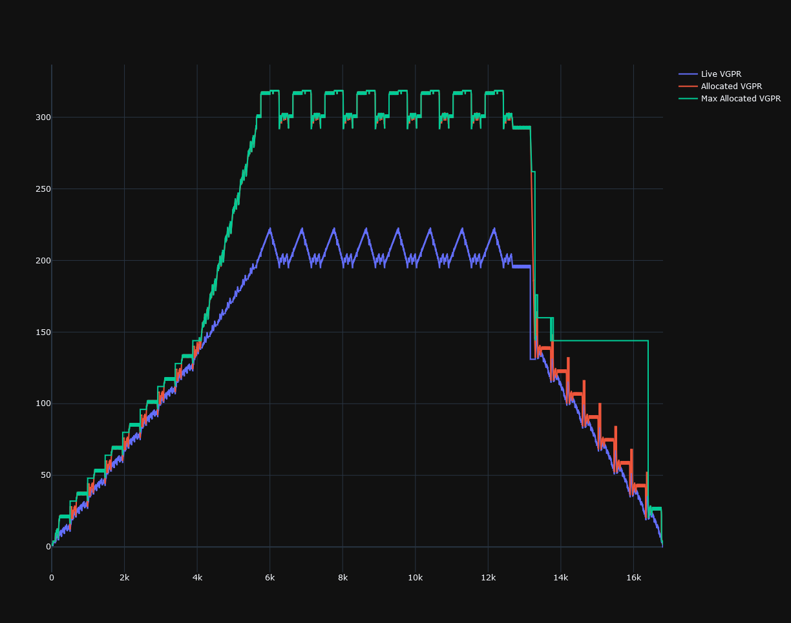

# `Register::Value` allocation and placeholders

One common pattern in codegen is to call a function that passes a register back as reference that is subsequently used in the code:

```C++
// An example of code that does not exhibit the problems described here.
Register::ValuePtr val;
co_yield generate(val, expression);
// ...
co_yield Instruction("v_foo_u32", {dest}, {val}, {}, "");
```


There are two common ways that this is made sub-optimal, potentially resulting in unnecessary register allocations and instructions:

## Placeholders


```C++
auto val = Register::Value::Placeholder(context, Register::Type::Vector, DataType::Int32, 1);
co_yield generate(val, expression);
// ...
co_yield Instruction("v_foo_u32", {dest}, {val}, {}, "");
```

This *is* necessary in some situations.  First, if we need to update `val` later, and we need it to remain in the same physical register location:

```C++
// An example of where a placeholder is needed for correctness.
// Note that val needs to be in the same physical register every time through the loop.

auto val = Register::Value::Placeholder(context, Register::Type::Vector, DataType::Int32, 1);
co_yield generate(val, expression);
// ...
co_yield Label("top");
co_yield Instruction("v_foo_u32", {dest}, {val}, {}, "");
// ...
co_yield Instruction("v_add_u32" {val}, {val, Literal(1)}, {}, "");
co_yield branchGen->branch("top");
```

In general this is only needed for registers that have to persist across loop iterations.

If this is not needed, making a `Placeholder` prevents us from using the optimization inside `Expression::generate()` that will simply assign the destination argument in the case of a simple expression.

Note that this optimization only works if `nullptr` is sent in to `generate()`.

If `expression` is just `v5`:

```C++
// An example where using a Placeholder will use an extra register and generate an additional
// instruction.

auto val = Register::Value::Placeholder(context, Register::Type::Vector, DataType::Int32, 1);
co_yield generate(val, expression); // This will allocate a new vector register and copy v5 into it.
// ...
co_yield Instruction("v_foo_u32", {dest}, {val}, {}, ""); // This will use the newly allocated register.
```

```C++
// This will generate better code than above.

Register::ValuePtr val;
// This will just assign the source `Register::Value` into `val`
co_yield generate(val, expression);
// ...
co_yield Instruction("v_foo_u32", {dest}, {val}, {}, ""); // This will use `v5`.
```

Note that this will also happen if `expression` is a literal.  This might not be ok if `v_foo_u32` can't accept a literal value or an SGPR.  In this situation, the `CopyGenerator` can conveniently fix this:

```C++
// An example of what to do if we need a value to be in a particular type of register.
// We will only have to allocate a register if we don't already have the correct value
// in a VGPR.

Register::ValuePtr val;

{
    Register::ValuePtr valTmp;
    // This will just assign the source `Register::Value` into `val` if possible.
    co_yield generate(valTmp, expression);

    // This will only copy if valTmp is not a VGPR or a literal.
    co_yield copyGen->ensureType(val, valTmp, {Register::Type::Vector, Register::Type::Literal});
}

co_yield Instruction("v_foo_u32", {dest}, {val}, {}, "");
```

## Manual register allocations

```C++
// An example of code that uses unnecessary manual allocation.

auto val = Register::Value::Placeholder(context, Register::Type::Vector, DataType::Int32, 4);

co_yield val->allocate();
// Alternately:
co_yield Register::AllocateIfNeeded(val);

co_yield generate(val, expression);
// ...
co_yield Instruction("v_foo_u32", {dest}, {val}, {}, "");
```

The *only* situation this should be used in most code is if we need to manually index into `val`, either with `subset()` or `element()`:

```C++
// An example of where `AllocateIfNeeded` should be called.
auto val = Register::Value::Placeholder(context, Register::Type::Vector, DataType::Int64, 1);

// This will throw an exception:
co_yield Instruction("v_add_co_u32", {val->subset({0})}, {a->subset({0}), b->subset({0})}, {}, "");
```

```C++
// Another example of where `AllocateIfNeeded` should be called.
auto vals = Register::Value::Placeholder(context, Register::Type::Vector, DataType::Int32, 2);

// This will throw an exception:
co_yield Instruction("v_add_u32", {vals->element({0})}, {a->element({0}), b->element({0})}, {}, "");
```

> ### Note:
> In both cases, it should be up to the function that is calling `subset()` or `element()` to call `AllocateIfNeeded()`, and not up to code calling that function to preemptively allocate:

```C++
// An illustration of where to place the call to AllocateIfNecessary.

Generator<Instruction> foo(...)
{
    auto val = Register::Value::Placeholder(context, Register::Type::Vector, DataType::Int64, 1);

    // co_yield val->allocate(); // BAD! bar() might be reimplemented not to need this manual
    //                           // allocation in the future!
    co_yield bar(val, ...);
}

Generator<Instruction> bar(...)
{
    co_yield Register::AllocateIfNecessary(val);
    co_yield Instruction("v_add_co_u32", {val->subset({0})}, {a->subset({0}), b->subset({0})}, {}, "");
}
```

It's also needed in `AssemblyKernel::allocateInitialRegisters()` to force the allocation to match the initial register state of the GPU.

The situations where this is suboptimal are more subtle than for placeholders, but also potentially more impactful:

1. Other code may be placed in between the manual allocation and the place where `subset()` is called.
    - This is the cause of the 'allocated' line going up faster than the 'live' line in the liveness graphs.
    - It's possible that other registers could be freed in the meantime, so if we delay the allocation as long as possible, we could reduce our high water mark.
2. If `subset()` and `element()` never end up being called, letting the allocation be done automatically when an instruction tries to write into that register gives the scheduler better information to go on.
3. It's possible that the registers are never actually needed, as evidenced by the gap between the high points between the highest allocated VGPR and the highest live VGPR.


