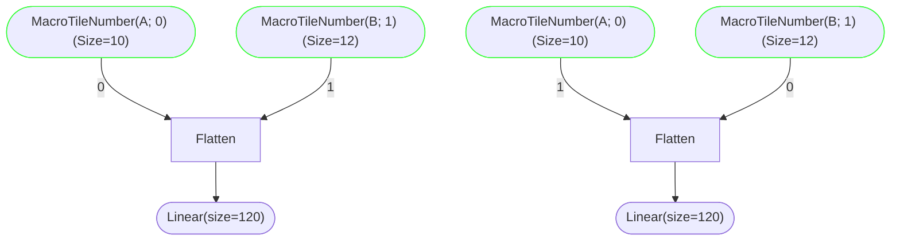

# Stream-K Plain & 2-tile Coordinate Transforms

For this document, we will assume the following:

| Dimension        |Value|
|------------------|-----|
| MacroTiles in M  |  10 |
| MacroTiles in N  |  12 |
| Total MacroTiles | 120 |
| K loop iterations| 512 |
| Workgroups       |  32 |

## Precondition

The Stream-K transformation starts with a coordinate graph similar to


There are two dangling `MacroTileNumber` coordinates, and the
`ForLoop(K)` coordinate.  In the data-parallel algorithm, the
`MacroTileNumber` coordinates are attached to workgroups, which
results in an implicit loop over the output M/N `D` tiles.  The K
tiles are looped over explicitly by each workgroup.

The Stream-K transform creates a flattened "global tile space" from
all of the M/N/K tiles.

## Stream-K

The flattened M/N/K global tile-space will be distributed evenly among
the workgroups (WGs).

Each workgroup (WG) needs to iterate over its portion of the flattened
global tile-space.

To facilitate accumulation initialization and prefetching etc, we use
two loops to accomplish this: an outer local-tile loop and an inner
accumulation (K) loop.

The inner loop iterates over the K tiles one-by-one.  The outer loop
iterates over the local portion of the global tile-space.  Its
increment is: however many tiles the inner K loop processed.

When the inner K loop advances, it will be advancing to a new K
tile, but will remain within the same M/N tile.  When the outer
tile loop advances, it will be advancing to a new M/N tile.

The local combined index

    wgTile = forTileIdx + forKIdx

is the current WGs local tile in its portion of the global tile-space.
Then

    tile = tilesPerWG * wg + wgTile

is the global tile that the WG is processing.  Given the global tile,
the M/N/K tile coordinates are

    m = (tile / numTilesK) / numTilesN;
    n = (tile / numTilesK) % numTilesN;
    k = tile % numTilesK;

This does not need a new kind of `CoordinateTransform` edge.  It can
be done with existing `Tile`, `Flatten`, and `Split` edges.


The control graph would implement code roughly equivalent to:

```C++
    auto totalTiles = numTilesM * numTilesN * numTilesK;
    auto tilesPerWG = (totalTiles + numWGs - 1) / numWGs;

    for(uint wg = 0; wg < numWGs; wg++)
    {
        uint forTileIdx, forKIdx;

        forKIdx = 0;
        for(forTileIdx = 0;
            (forTileIdx < tilesPerWG)
            && ((tilesPerWG * wg + forTileIdx) < totalTiles);
            forTileIdx += forKIdx)
        {
            uint tile;
            uint m, n, k;

            tile = tilesPerWG * wg + forTileIdx;

            m = (tile / numTilesK) / numTilesN;
            n = (tile / numTilesK) % numTilesN;
            k = tile % numTilesK;

            bool sendPartialTile = k > 0;

            // init accum and prefetch

            auto startMN = tile / numTilesK;
            for(forKIdx = 0;
                (((tilesPerWG * wg + forTileIdx + forKIdx) / numTilesK) == startMN)
                && (tilesPerWG * wg + forTileIdx + forKIdx < totalTiles)
                && (forTileIdx + forKIdx < tilesPerWG);
                forKIdx += 1)
            {
                tile = tilesPerWG * wg + forTileIdx + forKIdx;

                m = (tile / numTilesK) / numTilesN;
                n = (tile / numTilesK) % numTilesN;
                k = tile % numTilesK;

                // process the tile
            }

            bool receivePartialTile = k < numTilesK - 1;

            if(sendPartialTile)
            {
                // store partial tile to buffer
                // store flag
            }

            if(receivePartialTile)
            {
                while(flag == 0);

                // load partial tile from buffer
                // accumulate into my tile from for-K loop
            }

            if(!sendPartialTile)
            {
                // load C
                // multiply my tile by alpha
                // my tile += beta * C
                // store into D
            }
        }
    }

   ```

The Stream-K tiles will be done in a way that is fastest within the
ForTile loop of a particular workgroup.  This is difficult to change
at the lower level of this graph.

Reordering the tiles after the flattening the MacroTileNumber
dimensions (i.e. on the `Linear(size=120)` dimension), or reversing
the order of the `MacroTileNumber`s would be different ways of
changing the memory access pattern on this level if needed.

Swap input orders:


Reorder with tile/join:


## 2-Tile Stream-K

2-Tile stream-k will require an additional coordinate transform edge: `Sunder`.

This transform will cause the output (upstream) dimension to spread
its size unevenly between the first N-1 of its subdimensions. Its
value will be taken from one of the input (downstream) dimensions.
The last downstream dimension will be an index which determines which
of the dimensions to take.

The `ReverseEdgeVisitor` implementation will be something like:

```C++
std::vector<Expression::ExpressionPtr> operator()(Sunder const& e)
{
    AssertFatal(srcs.size() == 1, ShowValue(srcs.size()));
    AssertFatal(dsts.size() > 1, ShowValue(dsts.size()));

    auto index = getUnsignedInt(evaluate(dsts.back()));
    AssertFatal(index >= 0 && index < (dsts.size()-1));

    ExpressionPtr offset = nullptr;

    for(int i = 0; i < index-1; i++)
    {
        auto mySize = getSize(dsts[i]);
        offset = offset ? offset + mySize : mySize;
    }

    auto result = dsts[index];
    if(offset != nullptr)
        result += offset;

    return {result};
}
```

The `Sunder` edge will unevenly split the global M/N/K tile space into
two partitions: stream-k (SK) and data-parallel (DP):


## General 2-tile StreamK

The basic StreamK algorithm reduces granularity loss quite well.
However, there may be some inefficiencies in how global memory is
traverse compared to the basic data-parallel algorithm.  The two-tile
StreamK algorithm has two sections: a streaming "SK" section and a
data-parallel "DP" section.

We want to: maximize cache locality and minimize granularity loss
(quantization inefficiency).  This generally points us to:

1. Make the DP section as large as possible; and
2. Give the SK section some tiles to reduce granularity loss
   (quantization inefficiency).

In the data-parallel partition, we want each WG to process whole
output tiles so that: synchronization between WGs is not necessary,
and cache locality may be improved.  Processing whole output tiles
implies that each WG must process a multiple of K tiles (this would be
similar to a persistent-kernel data-parallel decomposition, where each
WG would process multiple output tiles).  The number of global tiles
processed in the data-parallel partition must therefore be aligned
with, and be a multiple of: WG * K.

To minimize granularity loss (quantization inefficiency) over the WGs
in the streaming partition, we want each WG to process at least one
output tile, but no more than two.

In the data-parallel section, each WG will process

    N_DP = (((M * N * K) // (WG * K) - 1) * WG * K

tiles; where // is "floor division".  Note:

1. This a multiple of WG * K (no synchronization); and
2. The "- 1" pushes enough tiles over to the streaming partition to
   minimize granulatity loss (quantization inefficiency) over the WGs.

Simplifying, we obtain

    N_DP = ((M * N * K) // (WG * K) - 1) * WG * K
         = ((M * N) // WG - 1) * WG * K

This means that

    N_SK = M * N * K - N_DP
         = K * (M * N - ((M * N) // WG - 1) * WG)
         = K * (M * N - ((M * N) // WG * WG - WG))
         = K * (M * N - (M * N) // WG * WG + WG)
         = K * ((M * N) % WG + WG)

tiles will be processed in the streaming partition.

If the total number of tiles is a multiple of WG * K, then we push all
tiles to the DP section, and hence

    if (M * N * K) % (WG * K) == 0:
       N_DP = M * N * K
       N_SK = 0

With the following definitions:

```C++
auto numTilesM  = M / macM;
auto numTilesN  = N / macN;
auto numTilesK  = K / macK;
auto numTilesDP = ((numTilesM * numTilesN) / numWGs - 1) * numWGs * numTilesK;
auto numTilesSK = numTilesK * ((numTilesM * numTilesN) % numWGs + numWGs);
AssertFatal(numTilesDP + numTilesSK == numTilesM * numTilesN * numTilesK);

auto numSKTilesPerWG = (numTilesSK + numWGs - 1) / numWGs;
auto numDPTilesPerWG = numTilesDP / numWGs;
```

We want to create a coordinate transform to compute the global tile number:
```C++
// In the SK section:
int tile = numSKTilesPerWG * wg + forTileIdx + forKIdx;

// In the DP section:
int tile = numTilesSK + numDPTilesPerWG * wg + forTileIdx + forKIdx;

// In both sections:
int m = (tile / numTilesK) / numTilesN;
int n = (tile / numTilesK) % numTilesN;
int k = tile % numTilesK;
```

This is accomplished by the following CT:

