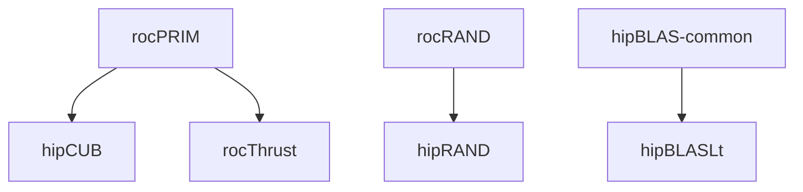

# Continuous Integration

> [!IMPORTANT]
> This document is currently in **draft** and may be subject to change.

This document is to detail the various continuous integration (CI) systems that are run on the rocm-systems super-repo.

## Table of Contents
1. [Azure Pipelines](#azure-pipelines)
    1. [Overview](#az-overview)
    2. [PR Workflow](#az-workflow)
    3. [Interpreting Results](#az-results)
    4. [Build and Test Coverage](#az-coverage)
    5. [Downstream Job Triggers](#az-downstream)
2. [Math CI](#math-ci)
    1. [Overview](#math-overview)
3. [Windows CI](#windows-ci)
    1. [Overview](#win-overview)
4. [TheRock CI](#therock-ci)
    1. [Overview](#rock-overview)

## Azure Pipelines

### Overview 

The ROCm Azure Pipelines CI (also known as External CI) is a public-facing CI system that builds and tests against latest public source code. It encompasses almost all of the ROCm stack, typically pulling source code from the `develop` or `amd-staging` branch on a component's GitHub repository. The CI's main source is publically available at [ROCm/ROCm/.azuredevops](https://github.com/ROCm/ROCm/tree/develop/.azuredevops).

See the [Azure super-repo dashboard](https://dev.azure.com/ROCm-CI/ROCm-CI/_build?definitionScope=%5Csuper-repo) for a full list of pipelines running in the super-repo.

For commits, the pipelines will run based on the conditions defined in the trigger files under [/.azuredevops](https://github.com/ROCm/rocm-systems/tree/develop/.azuredevops).

For PRs, the [`Dispatch Azure CI`](https://github.com/ROCm/rocm-systems/blob/develop/.github/workflows/azure-ci-dispatcher.yml) GitHub Action will be run, which will analyze a PR's contents and determine which pipelines to run. This action will report the final results of each Azure run it dispatches.

### PR Workflow 

1. PR is submitted
2. `Dispatch Azure CI` is run on the PR
    1. Analyzes the PR's contents, determines which pipelines to run
    2. Sends request(s) to Azure API to start runs
3. Azure CI builds and tests the PR against latest public source
4. `Dispatch Azure CI` waits until all runs are finished and reports their overall status

URLs for individual Azure runs can be found in the logs of the `Dispatch Azure CI` action, under the `Wait for and report Azure CI` step.

### Interpreting Results 

Any errors or warnings during a run will be highlighted on the run's main page on Azure, and clicking on those will bring you directly to the offending logs.

Azure runs can have the following statuses: `Success`, `Failed`, or `Warning`. This corresponds to GitHub status checks as follows:

| Azure Status | GitHub PR Status | Explanation |
|-|-|-|
| ✅ Success | ✅ Succeeded | The job was successful. |
| ⚠️ Warning | ✅ Succeeded with issues | An allowed failure occurred and the job continued on without further issue. |
| ❌ Failed | ❌ Failing | The job failed. |
| Did not run | ⬛ Neutral | The job did not run, likely due to not fulfilling the trigger requirements. |

Warnings can occur if a step fails but was marked as being allowed to fail, so a job will continue running in the event of a warning.

In particular, steps are allowed to fail if they have the property `continueOnError: true` ([reference](https://learn.microsoft.com/en-us/azure/devops/pipelines/process/tasks?view=azure-devops&tabs=yaml#task-control-options)).

### Build and Test Coverage 

Azure CI builds and tests primarily on Ubuntu 22.04 LTS and for `gfx942` and `gfx90a` architectures, and adding build support for more architectures and operating systems is in progress.

Build coverage:
| | Ubuntu 22.04 | Almalinux 8 |
|-|-|-|
| **gfx942** | ✅ Supported | ✅ Supported |
| **gfx90a** | ✅ Supported | ✅ Supported |
| **gfx1201** | 🚧 In progress | 🚧 In progress |
| **gfx1100** | 🚧 In progress | 🚧 In progress |
| **gfx1030** | 🚧 In progress | 🚧 In progress |

Test coverage:
| | Ubuntu 22.04 | Almalinux 8 |
|-|-|-|
| **gfx942** | ✅ Supported | ❌ Unsupported |
| **gfx90a** | ✅ Supported | ❌ Unsupported |
| **gfx1201** | ❌ Unsupported | ❌ Unsupported |
| **gfx1100** | ❌ Unsupported | ❌ Unsupported |
| **gfx1030** | ❌ Unsupported | ❌ Unsupported |

For testing, the majority of components use `ctest` or `gtest`. Component-specific details such as build flags and test configurations can be viewed in a component's main pipeline file in [ROCm/ROCm/.azuredevops/components](https://github.com/ROCm/ROCm/tree/develop/.azuredevops/components).

### Downstream Job Triggers 

Azure CI runs for a component will trigger runs for downstream components (provided that they are fully migrated onto the super-repo). The end goal is to catch upstream breaking changes before they are merged and to ensure the super-repo is always in a valid state.

For example: a rocPRIM PR will trigger a rocPRIM job. If successful, it will then continue to run hipCUB and rocThrust jobs.

Currently, the following downstream trigger paths are enabled:

## Math CI

### Overview 

## Windows CI

### Overview 

## TheRock CI

### Overview 
