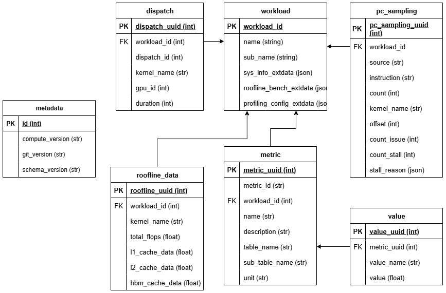
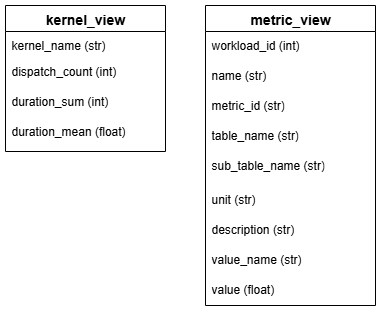

.. meta::
   :description: ROCm Compute Profiler analysis: CLI analysis
   :keywords: ROCm Compute Profiler, ROCm, profiler, tool, Instinct, accelerator, command line, analyze, filtering, metrics, baseline, comparison

************
CLI analysis
************

This section provides an overview of ROCm Compute Profiler's CLI analysis features.

* :ref:`Derived metrics <cli-list-metrics>`: All of ROCm Compute Profiler's built-in metrics.

* :ref:`Baseline comparison <analysis-baseline-comparison>`: Compare multiple
  runs in a side-by-side manner.

* :ref:`Metric customization <cli-analysis-options>`: Isolate a subset of
  built-in metrics or build your own profiling configuration.

* :ref:`Filtering <cli-analysis-options>`: Hone in on a particular kernel,
  GPU ID, or dispatch ID via post-process filtering.

* :ref:`Per-kernel roofline analysis <per-kernel-roofline>`: Detailed arithmetic
   intensity and performance analysis for individual kernels.

Run ``rocprof-compute analyze -h`` for more details.

.. _cli-walkthrough:

Walkthrough
===========

1. To begin, generate a high-level analysis report using ROCm Compute Profiler's ``-b`` (or ``--block``) flag.

There are three high-level GPU analysis views:

* System Speed-of-Light: Key GPU performance metrics to show overall GPU performance and utilization.
* Memory chart: Shows memory transactions and throughput on each cache hierarchical level.
* Empirical hierarchical roofline: Roofline model that compares achieved throughput with attainable peak hardware limits, more specifically peak compute throughput and memory bandwidth (on L1/LDS/L2/HBM). When combined with kernel filtering, provides detailed per-kernel arithmetic intensity analysis and performance breakdowns.

**System Speed-of-Light:**

.. code-block:: shell-session

   $ rocprof-compute analyze -p workloads/vcopy/MI200/ -b 2

.. image:: ../../data/analyze/cli/system_speed_of_light.png
   :align: left
   :alt: System Speed Of Light

**Memory chart:**

.. code-block:: shell-session

   $ rocprof-compute analyze -p workloads/vcopy/MI200/ -b 3

.. image:: ../../data/analyze/cli/mem_chart.png
   :align: left
   :alt: Memory Chart

**Empirical hierarchical roofline:**

.. code-block:: shell-session

   $ rocprof-compute analyze -p workloads/vcopy/MI200/ -b 4

.. image:: ../../data/analyze/cli/roofline_chart.png
   :align: left
   :alt: Roofline

.. note::
   * Visualized memory chart and Roofline chart are only supported in single run analysis. In multiple runs comparison mode, both are switched back to basic table view.
   * Visualized memory chart requires the width of the terminal output to be greater than or equal to 234 to display the whole chart properly.
   * Visualized Roofline chart is adapted to the initial terminal size only. If it is not clear, you may need to adjust the terminal size and regenerate it to check the display effect. Roofline analysis provides detailed, structured table output with measured empirical peak values for comparison.

.. _cli-list-available-metrics:

2. Use ``--list-available-metrics`` to generate a list of available metrics for inspection.

   .. code-block:: shell-session

      $ rocprof-compute analyze -p workloads/vcopy/MI200/ --list-available-metrics

                                       __                                       _
       _ __ ___   ___ _ __  _ __ ___  / _|       ___ ___  _ __ ___  _ __  _   _| |_ ___
      | '__/ _ \ / __| '_ \| '__/ _ \| |_ _____ / __/ _ \| '_ ` _ \| '_ \| | | | __/ _ \
      | | | (_) | (__| |_) | | | (_) |  _|_____| (_| (_) | | | | | | |_) | |_| | ||  __/
      |_|  \___/ \___| .__/|_|  \___/|_|        \___\___/|_| |_| |_| .__/ \__,_|\__\___|
                     |_|                                           |_|

      Analysis mode = cli
      [analysis] deriving rocprofiler-compute metrics...
      0 -> Top Stats
      1 -> System Info
      2 -> System Speed-of-Light
              2.1 -> Speed-of-Light
                      2.1.0 -> VALU FLOPs
                      2.1.1 -> VALU IOPs
                      2.1.2 -> MFMA FLOPs (BF16)
                      2.1.3 -> MFMA FLOPs (F16)
                      2.1.4 -> MFMA FLOPs (F32)
                      2.1.5 -> MFMA FLOPs (F64)
                      2.1.6 -> MFMA IOPs (Int8)
                      2.1.7 -> Active CUs
                      2.1.8 -> SALU Utilization
                      2.1.9 -> VALU Utilization
                      2.1.10 -> MFMA Utilization
                      2.1.11 -> VMEM Utilization
                      2.1.12 -> Branch Utilization
                      2.1.13 -> VALU Active Threads
                      2.1.14 -> IPC
                      2.1.15 -> Wavefront Occupancy
                      2.1.16 -> Theoretical LDS Bandwidth
                      2.1.17 -> LDS Bank Conflicts/Access
                      2.1.18 -> vL1D Cache Hit Rate
                      2.1.19 -> vL1D Cache BW
                      2.1.20 -> L2 Cache Hit Rate
                      2.1.21 -> L2 Cache BW
                       2.1.22 -> L2-Fabric Read BW
                      2.1.23 -> L2-Fabric Write BW
                      2.1.24 -> L2-Fabric Read Latency
                      2.1.25 -> L2-Fabric Write Latency
                      2.1.26 -> sL1D Cache Hit Rate
                      2.1.27 -> sL1D Cache BW
                      2.1.28 -> L1I Hit Rate
                      2.1.29 -> L1I BW
                      2.1.30 -> L1I Fetch Latency
      ...

3. Choose your own customized subset of metrics with the ``-b`` (or ``--block``)
   option. Or, build your own configuration following
   `config_template <https://github.com/ROCm/rocm-systems/blob/develop/projects/rocprofiler-compute/src/rocprof_compute_soc/analysis_configs/panel_config_template.yaml>`_.
   The following snippet shows how to generate a report containing only metric 2
   (:doc:`System Speed-of-Light </conceptual/system-speed-of-light>`).

   .. code-block:: shell-session

      $ rocprof-compute analyze -p workloads/vcopy/MI200/ -b 2

      --------
      Analyze
      --------

      --------------------------------------------------------------------------------
      1. Top Stat
      ╒════╤══════════════════════════════════════════╤═════════╤═══════════╤════════════╤══════════════╤════════╕
      │    │ KernelName                               │   Count │   Sum(ns) │   Mean(ns) │   Median(ns) │    Pct │
      ╞════╪══════════════════════════════════════════╪═════════╪═══════════╪════════════╪══════════════╪════════╡
      │  0 │ vecCopy(double*, double*, double*, int,  │       1 │  20000.00 │   20000.00 │     20000.00 │ 100.00 │
      │    │ int) [clone .kd]                         │         │           │            │              │        │
      ╘════╧══════════════════════════════════════════╧═════════╧═══════════╧════════════╧══════════════╧════════╛

      --------------------------------------------------------------------------------
      2. System Speed-of-Light
      ╒═════════╤═══════════════════════════╤═══════════════════════╤══════════════════╤════════════════════╤════════════════════════╕
      │ Index   │ Metric                    │ Value                 │ Unit             │ Peak               │ PoP                    │
      ╞═════════╪═══════════════════════════╪═══════════════════════╪══════════════════╪════════════════════╪════════════════════════╡
      │ 2.1.0   │ VALU FLOPs                │ 0.0                   │ Gflop            │ 22630.4            │ 0.0                    │
      ├─────────┼───────────────────────────┼───────────────────────┼──────────────────┼────────────────────┼────────────────────────┤
      │ 2.1.1   │ VALU IOPs                 │ 367.0016              │ Giop             │ 22630.4            │ 1.6217194570135745     │
      ├─────────┼───────────────────────────┼───────────────────────┼──────────────────┼────────────────────┼────────────────────────┤
      │ 2.1.2   │ MFMA FLOPs (BF16)         │ 0.0                   │ Gflop            │ 90521.6            │ 0.0                    │
      ├─────────┼───────────────────────────┼───────────────────────┼──────────────────┼────────────────────┼────────────────────────┤
      │ 2.1.3   │ MFMA FLOPs (F16)          │ 0.0                   │ Gflop            │ 181043.2           │ 0.0                    │
      ├─────────┼───────────────────────────┼───────────────────────┼──────────────────┼────────────────────┼────────────────────────┤
      │ 2.1.4   │ MFMA FLOPs (F32)          │ 0.0                   │ Gflop            │ 45260.8            │ 0.0                    │
      ├─────────┼───────────────────────────┼───────────────────────┼──────────────────┼────────────────────┼────────────────────────┤
      │ 2.1.5   │ MFMA FLOPs (F64)          │ 0.0                   │ Gflop            │ 45260.8            │ 0.0                    │
      ├─────────┼───────────────────────────┼───────────────────────┼──────────────────┼────────────────────┼────────────────────────┤
      │ 2.1.6   │ MFMA IOPs (Int8)          │ 0.0                   │ Giop             │ 181043.2           │ 0.0                    │
      ├─────────┼───────────────────────────┼───────────────────────┼──────────────────┼────────────────────┼────────────────────────┤
      │ 2.1.7   │ Active CUs                │ 74                    │ Cus              │ 104                │ 71.15384615384616      │
      ├─────────┼───────────────────────────┼───────────────────────┼──────────────────┼────────────────────┼────────────────────────┤
      │ 2.1.8   │ SALU Util                 │ 4.016057506716307     │ Pct              │ 100                │ 4.016057506716307      │
      ├─────────┼───────────────────────────┼───────────────────────┼──────────────────┼────────────────────┼────────────────────────┤
      │ 2.1.9   │ VALU Util                 │ 5.737225009594725     │ Pct              │ 100                │ 5.737225009594725      │
      ├─────────┼───────────────────────────┼───────────────────────┼──────────────────┼────────────────────┼────────────────────────┤
      │ 2.1.10  │ MFMA Util                 │ 0.0                   │ Pct              │ 100                │ 0.0                    │
      ├─────────┼───────────────────────────┼───────────────────────┼──────────────────┼────────────────────┼────────────────────────┤
      │ 2.1.11  │ VALU Active Threads/Wave  │ 64.0                  │ Threads          │ 64                 │ 100.0                  │
      ├─────────┼───────────────────────────┼───────────────────────┼──────────────────┼────────────────────┼────────────────────────┤
      │ 2.1.12  │ IPC - Issue               │ 1.0                   │ Instr/cycle      │ 5                  │ 20.0                   │
      ├─────────┼───────────────────────────┼───────────────────────┼──────────────────┼────────────────────┼────────────────────────┤
      │ 2.1.13  │ LDS BW                    │ 0.0                   │ Gb/sec           │ 22630.4            │ 0.0                    │
      ├─────────┼───────────────────────────┼───────────────────────┼──────────────────┼────────────────────┼────────────────────────┤
      │ 2.1.14  │ LDS Bank Conflict         │                       │ Conflicts/access │ 32                 │                        │
      ├─────────┼───────────────────────────┼───────────────────────┼──────────────────┼────────────────────┼────────────────────────┤
      │ 2.1.15  │ Instr Cache Hit Rate      │ 99.91306912556854     │ Pct              │ 100                │ 99.91306912556854      │
      ├─────────┼───────────────────────────┼───────────────────────┼──────────────────┼────────────────────┼────────────────────────┤
      │ 2.1.16  │ Instr Cache BW            │ 209.7152              │ Gb/s             │ 6092.8             │ 3.442016806722689      │
      ├─────────┼───────────────────────────┼───────────────────────┼──────────────────┼────────────────────┼────────────────────────┤
      │ 2.1.17  │ Scalar L1D Cache Hit Rate │ 99.81986908342313     │ Pct              │ 100                │ 99.81986908342313      │
      ├─────────┼───────────────────────────┼───────────────────────┼──────────────────┼────────────────────┼────────────────────────┤
      │ 2.1.18  │ Scalar L1D Cache BW       │ 209.7152              │ Gb/s             │ 6092.8             │ 3.442016806722689      │
      ├─────────┼───────────────────────────┼───────────────────────┼──────────────────┼────────────────────┼────────────────────────┤
      │ 2.1.19  │ Vector L1D Cache Hit Rate │ 50.0                  │ Pct              │ 100                │ 50.0                   │
      ├─────────┼───────────────────────────┼───────────────────────┼──────────────────┼────────────────────┼────────────────────────┤
      │ 2.1.20  │ Vector L1D Cache BW       │ 1677.7216             │ Gb/s             │ 11315.199999999999 │ 14.82714932126697      │
      ├─────────┼───────────────────────────┼───────────────────────┼──────────────────┼────────────────────┼────────────────────────┤
      │ 2.1.21  │ L2 Cache Hit Rate         │ 35.55067615693325     │ Pct              │ 100                │ 35.55067615693325      │
      ├─────────┼───────────────────────────┼───────────────────────┼──────────────────┼────────────────────┼────────────────────────┤
      │ 2.1.22  │ L2-Fabric Read BW         │ 419.8496              │ Gb/s             │ 1638.4             │ 25.6255859375          │
      ├─────────┼───────────────────────────┼───────────────────────┼──────────────────┼────────────────────┼────────────────────────┤
      │ 2.1.23  │ L2-Fabric Write BW        │ 293.9456              │ Gb/s             │ 1638.4             │ 17.941015625           │
      ├─────────┼───────────────────────────┼───────────────────────┼──────────────────┼────────────────────┼────────────────────────┤
      │ 2.1.24  │ L2-Fabric Read Latency    │ 256.6482321288385     │ Cycles           │                    │                        │
      ├─────────┼───────────────────────────┼───────────────────────┼──────────────────┼────────────────────┼────────────────────────┤
      │ 2.1.25  │ L2-Fabric Write Latency   │ 317.2264255699014     │ Cycles           │                    │                        │
      ├─────────┼───────────────────────────┼───────────────────────┼──────────────────┼────────────────────┼────────────────────────┤
      │ 2.1.26  │ Wave Occupancy            │ 1821.723057333852     │ Wavefronts       │ 3328               │ 54.73927455931046      │
      ├─────────┼───────────────────────────┼───────────────────────┼──────────────────┼────────────────────┼────────────────────────┤
      │ 2.1.27  │ Instr Fetch BW            │ 4.174722306564298e-08 │ Gb/s             │ 3046.4             │ 1.3703789084047721e-09 │
      ├─────────┼───────────────────────────┼───────────────────────┼──────────────────┼────────────────────┼────────────────────────┤
      │ 2.1.28  │ Instr Fetch Latency       │ 21.729248046875       │ Cycles           │                    │                        │
      ╘═════════╧═══════════════════════════╧═══════════════════════╧══════════════════╧════════════════════╧════════════════════════╛

   Alternatively, use the option ``-b`` (or ``--block``) with block alias(es).
   The following snippet shows how to generate a report containing only metric 2 with the alias equivalent of ``sol``

   .. code-block:: shell-session

      $ rocprof-compute analyze -p workloads/vcopy/MI200/ -b sol

      --------
      Analyze
      --------

      --------------------------------------------------------------------------------
      1. Top Stat
      ╒════╤══════════════════════════════════════════╤═════════╤═══════════╤════════════╤══════════════╤════════╕
      │    │ KernelName                               │   Count │   Sum(ns) │   Mean(ns) │   Median(ns) │    Pct │
      ╞════╪══════════════════════════════════════════╪═════════╪═══════════╪════════════╪══════════════╪════════╡
      │  0 │ vecCopy(double*, double*, double*, int,  │       1 │  20000.00 │   20000.00 │     20000.00 │ 100.00 │
      │    │ int) [clone .kd]                         │         │           │            │              │        │
      ╘════╧══════════════════════════════════════════╧═════════╧═══════════╧════════════╧══════════════╧════════╛

      --------------------------------------------------------------------------------
      2. System Speed-of-Light
      ╒═════════╤═══════════════════════════╤═══════════════════════╤══════════════════╤════════════════════╤════════════════════════╕
      │ Index   │ Metric                    │ Value                 │ Unit             │ Peak               │ PoP                    │
      ╞═════════╪═══════════════════════════╪═══════════════════════╪══════════════════╪════════════════════╪════════════════════════╡
      │ 2.1.0   │ VALU FLOPs                │ 0.0                   │ Gflop            │ 22630.4            │ 0.0                    │
      ├─────────┼───────────────────────────┼───────────────────────┼──────────────────┼────────────────────┼────────────────────────┤
      │ 2.1.1   │ VALU IOPs                 │ 367.0016              │ Giop             │ 22630.4            │ 1.6217194570135745     │
      ├─────────┼───────────────────────────┼───────────────────────┼──────────────────┼────────────────────┼────────────────────────┤
      │ 2.1.2   │ MFMA FLOPs (BF16)         │ 0.0                   │ Gflop            │ 90521.6            │ 0.0                    │
      ├─────────┼───────────────────────────┼───────────────────────┼──────────────────┼────────────────────┼────────────────────────┤
      │ 2.1.3   │ MFMA FLOPs (F16)          │ 0.0                   │ Gflop            │ 181043.2           │ 0.0                    │
      ├─────────┼───────────────────────────┼───────────────────────┼──────────────────┼────────────────────┼────────────────────────┤
      │ 2.1.4   │ MFMA FLOPs (F32)          │ 0.0                   │ Gflop            │ 45260.8            │ 0.0                    │
      ├─────────┼───────────────────────────┼───────────────────────┼──────────────────┼────────────────────┼────────────────────────┤
      │ 2.1.5   │ MFMA FLOPs (F64)          │ 0.0                   │ Gflop            │ 45260.8            │ 0.0                    │
      ├─────────┼───────────────────────────┼───────────────────────┼──────────────────┼────────────────────┼────────────────────────┤
      │ 2.1.6   │ MFMA IOPs (Int8)          │ 0.0                   │ Giop             │ 181043.2           │ 0.0                    │
      ├─────────┼───────────────────────────┼───────────────────────┼──────────────────┼────────────────────┼────────────────────────┤
      │ 2.1.7   │ Active CUs                │ 74                    │ Cus              │ 104                │ 71.15384615384616      │
      ├─────────┼───────────────────────────┼───────────────────────┼──────────────────┼────────────────────┼────────────────────────┤
      │ 2.1.8   │ SALU Util                 │ 4.016057506716307     │ Pct              │ 100                │ 4.016057506716307      │
      ├─────────┼───────────────────────────┼───────────────────────┼──────────────────┼────────────────────┼────────────────────────┤
      │ 2.1.9   │ VALU Util                 │ 5.737225009594725     │ Pct              │ 100                │ 5.737225009594725      │
      ├─────────┼───────────────────────────┼───────────────────────┼──────────────────┼────────────────────┼────────────────────────┤
      │ 2.1.10  │ MFMA Util                 │ 0.0                   │ Pct              │ 100                │ 0.0                    │
      ├─────────┼───────────────────────────┼───────────────────────┼──────────────────┼────────────────────┼────────────────────────┤
      │ 2.1.11  │ VALU Active Threads/Wave  │ 64.0                  │ Threads          │ 64                 │ 100.0                  │
      ├─────────┼───────────────────────────┼───────────────────────┼──────────────────┼────────────────────┼────────────────────────┤
      │ 2.1.12  │ IPC - Issue               │ 1.0                   │ Instr/cycle      │ 5                  │ 20.0                   │
      ├─────────┼───────────────────────────┼───────────────────────┼──────────────────┼────────────────────┼────────────────────────┤
      │ 2.1.13  │ LDS BW                    │ 0.0                   │ Gb/sec           │ 22630.4            │ 0.0                    │
      ├─────────┼───────────────────────────┼───────────────────────┼──────────────────┼────────────────────┼────────────────────────┤
      │ 2.1.14  │ LDS Bank Conflict         │                       │ Conflicts/access │ 32                 │                        │
      ├─────────┼───────────────────────────┼───────────────────────┼──────────────────┼────────────────────┼────────────────────────┤
      │ 2.1.15  │ Instr Cache Hit Rate      │ 99.91306912556854     │ Pct              │ 100                │ 99.91306912556854      │
      ├─────────┼───────────────────────────┼───────────────────────┼──────────────────┼────────────────────┼────────────────────────┤
      │ 2.1.16  │ Instr Cache BW            │ 209.7152              │ Gb/s             │ 6092.8             │ 3.442016806722689      │
      ├─────────┼───────────────────────────┼───────────────────────┼──────────────────┼────────────────────┼────────────────────────┤
      │ 2.1.17  │ Scalar L1D Cache Hit Rate │ 99.81986908342313     │ Pct              │ 100                │ 99.81986908342313      │
      ├─────────┼───────────────────────────┼───────────────────────┼──────────────────┼────────────────────┼────────────────────────┤
      │ 2.1.18  │ Scalar L1D Cache BW       │ 209.7152              │ Gb/s             │ 6092.8             │ 3.442016806722689      │
      ├─────────┼───────────────────────────┼───────────────────────┼──────────────────┼────────────────────┼────────────────────────┤
      │ 2.1.19  │ Vector L1D Cache Hit Rate │ 50.0                  │ Pct              │ 100                │ 50.0                   │
      ├─────────┼───────────────────────────┼───────────────────────┼──────────────────┼────────────────────┼────────────────────────┤
      │ 2.1.20  │ Vector L1D Cache BW       │ 1677.7216             │ Gb/s             │ 11315.199999999999 │ 14.82714932126697      │
      ├─────────┼───────────────────────────┼───────────────────────┼──────────────────┼────────────────────┼────────────────────────┤
      │ 2.1.21  │ L2 Cache Hit Rate         │ 35.55067615693325     │ Pct              │ 100                │ 35.55067615693325      │
      ├─────────┼───────────────────────────┼───────────────────────┼──────────────────┼────────────────────┼────────────────────────┤
      │ 2.1.22  │ L2-Fabric Read BW         │ 419.8496              │ Gb/s             │ 1638.4             │ 25.6255859375          │
      ├─────────┼───────────────────────────┼───────────────────────┼──────────────────┼────────────────────┼────────────────────────┤
      │ 2.1.23  │ L2-Fabric Write BW        │ 293.9456              │ Gb/s             │ 1638.4             │ 17.941015625           │
      ├─────────┼───────────────────────────┼───────────────────────┼──────────────────┼────────────────────┼────────────────────────┤
      │ 2.1.24  │ L2-Fabric Read Latency    │ 256.6482321288385     │ Cycles           │                    │                        │
      ├─────────┼───────────────────────────┼───────────────────────┼──────────────────┼────────────────────┼────────────────────────┤
      │ 2.1.25  │ L2-Fabric Write Latency   │ 317.2264255699014     │ Cycles           │                    │                        │
      ├─────────┼───────────────────────────┼───────────────────────┼──────────────────┼────────────────────┼────────────────────────┤
      │ 2.1.26  │ Wave Occupancy            │ 1821.723057333852     │ Wavefronts       │ 3328               │ 54.73927455931046      │
      ├─────────┼───────────────────────────┼───────────────────────┼──────────────────┼────────────────────┼────────────────────────┤
      │ 2.1.27  │ Instr Fetch BW            │ 4.174722306564298e-08 │ Gb/s             │ 3046.4             │ 1.3703789084047721e-09 │
      ├─────────┼───────────────────────────┼───────────────────────┼──────────────────┼────────────────────┼────────────────────────┤
      │ 2.1.28  │ Instr Fetch Latency       │ 21.729248046875       │ Cycles           │                    │                        │
      ╘═════════╧═══════════════════════════╧═══════════════════════╧══════════════════╧════════════════════╧════════════════════════╛
   .. note::

      Some cells may be blank indicating a missing or unavailable hardware
      counter or NULL value.

4. Optimize the application, iterate, and re-profile to inspect performance
   changes.

5. Redo a comprehensive analysis with ROCm Compute Profiler CLI at any optimization
   milestone.

.. _cli-analysis-options:

More analysis options
=====================

Single run
  .. code-block:: shell

     $ rocprof-compute analyze -p workloads/vcopy/MI200/

List top kernels and dispatches
  .. code-block:: shell

     $ rocprof-compute analyze -p workloads/vcopy/MI200/  --list-stats

List metrics
  .. code-block:: shell

     $ rocprof-compute analyze -p workloads/vcopy/MI200/  --list-metrics gfx90a

List IP blocks
  .. code-block:: shell

     $ rocprof-compute analyze -p workloads/vcopy/MI200/  --list-blocks gfx90a

Show Description column which is excluded by default in cli output
  .. code-block:: shell

     $ rocprof-compute analyze -p workloads/vcopy/MI200/  --list-metrics gfx90a --include-cols Description

Show System Speed-of-Light and CS_Busy blocks only
  .. code-block:: shell

     $ rocprof-compute analyze -p workloads/vcopy/MI200/  -b 2  5.1.0

.. note::

   You can filter a single metric or the whole hardware component by its ID. In
   this case, ``1`` is the ID for System Speed-of-Light and ``5.1.0`` the ID for
   GPU Busy Cycles metric.

Filter kernels
  First, list the top kernels in your application using `--list-stats`.

  .. code-block::

     $ rocprof-compute analyze -p workloads/vcopy/MI200/ --list-stats

     Analysis mode = cli
     [analysis] deriving rocprofiler-compute metrics...

     --------------------------------------------------------------------------------
     Detected Kernels (sorted descending by duration)
     ╒════╤══════════════════════════════════════════════╕
     │    │ Kernel_Name                                  │
     ╞════╪══════════════════════════════════════════════╡
     │  0 │ vecCopy(double*, double*, double*, int, int) │
     ╘════╧══════════════════════════════════════════════╛

     --------------------------------------------------------------------------------
     Dispatch list
     ╒════╤═══════════════╤══════════════════════════════════════════════╤══════════╕
     │    │   Dispatch_ID │ Kernel_Name                                  │   GPU_ID │
     ╞════╪═══════════════╪══════════════════════════════════════════════╪══════════╡
     │  0 │             0 │ vecCopy(double*, double*, double*, int, int) │        0 │
     ╘════╧═══════════════╧══════════════════════════════════════════════╧══════════╛

  Second, select the index of the kernel you would like to filter; for example,
  ``vecCopy(double*, double*, double*, int, int) [clone .kd]`` at index ``0``.
  Then, use this index to apply the filter via ``-k`` or ``--kernels``.

  .. code-block:: shell-session

     $ rocprof-compute analyze -p workloads/vcopy/MI200/ -k 0

     Analysis mode = cli
     [analysis] deriving rocprofiler-compute metrics...

     --------------------------------------------------------------------------------
     0. Top Stats
     0.1 Top Kernels
     ╒════╤══════════════════════════════════════════╤═════════╤═══════════╤════════════╤══════════════╤════════╤═════╕
     │    │ Kernel_Name                              │   Count │   Sum(ns) │   Mean(ns) │   Median(ns) │    Pct │ S   │
     ╞════╪══════════════════════════════════════════╪═════════╪═══════════╪════════════╪══════════════╪════════╪═════╡
     │  0 │ vecCopy(double*, double*, double*, int,  │    1.00 │  18560.00 │   18560.00 │     18560.00 │ 100.00 │ *   │
     │    │ int)                                     │         │           │            │              │        │     │
     ╘════╧══════════════════════════════════════════╧═════════╧═══════════╧════════════╧══════════════╧════════╧═════╛
     ...

  You should see your filtered kernels indicated by an asterisk in the **Top
  Stats** table.

.. _per-kernel-roofline:

Per-kernel roofline analysis
  When analyzing specific kernels, the roofline analysis provides detailed metrics for each filtered kernel:

  .. code-block:: shell-session

     $ rocprof-compute analyze -p workloads/vcopy/MI200/ -k 0 -b 4
  This generates enhanced roofline output showing per-kernel performance rates and arithmetic intensity calculations:

  .. code-block:: text

   ================================================================================
   4. Roofline
   ================================================================================
   (4.1) Per-Kernel Roofline Metrics and (4.2) AI Plot Points
   --------------------------------------------------------------------------------
   Kernel 0: vecCopy(double*, double*, double*, int, int) (100.0%)
      |
      ├─ 4.1 Roofline Rate Metrics:
      |   ╒═════════════╤════════════════════╤═══════════════════╤═════════╤════════════════════╕
      |   │ Metric_ID   │ Metric             │ Value             │ Unit    │   Peak (Empirical) │
      |   ╞═════════════╪════════════════════╪═══════════════════╪═════════╪════════════════════╡
      |   │ 4.1.0       │ VALU FLOPs         │                   │ Gflop/s │           61286.40 │
      |   ├─────────────┼────────────────────┼───────────────────┼─────────┼────────────────────┤
      |   │ 4.1.1       │ MFMA FLOPs (F64)   │                   │ Gflop/s │          108544.33 │
      |   ├─────────────┼────────────────────┼───────────────────┼─────────┼────────────────────┤
      |   │ 4.1.2       │ MFMA FLOPs (F32)   │                   │ Gflop/s │          104531.42 │
      |   ├─────────────┼────────────────────┼───────────────────┼─────────┼────────────────────┤
      |   │ 4.1.3       │ MFMA FLOPs (F16)   │                   │ Gflop/s │          709169.38 │
      |   ├─────────────┼────────────────────┼───────────────────┼─────────┼────────────────────┤
      |   │ 4.1.4       │ MFMA FLOPs (BF16)  │ 0.0               │ Gflop/s │          388161.09 │
      |   ├─────────────┼────────────────────┼───────────────────┼─────────┼────────────────────┤
      |   │ 4.1.5       │ MFMA FLOPs (F8)    │ 0.0               │ Gflop/s │         1446089.60 │
      |   ├─────────────┼────────────────────┼───────────────────┼─────────┼────────────────────┤
      |   │ 4.1.6       │ MFMA IOPs (Int8)   │                   │ Giop/s  │          737317.94 │
      |   ├─────────────┼────────────────────┼───────────────────┼─────────┼────────────────────┤
      |   │ 4.1.7       │ HBM Bandwidth      │                   │ Gb/s    │            3231.95 │
      |   ├─────────────┼────────────────────┼───────────────────┼─────────┼────────────────────┤
      |   │ 4.1.8       │ L2 Cache Bandwidth │                   │ Gb/s    │           19096.81 │
      |   ├─────────────┼────────────────────┼───────────────────┼─────────┼────────────────────┤
      |   │ 4.1.9       │ L1 Cache Bandwidth │ 3880.358726762844 │ Gb/s    │           25006.24 │
      |   ├─────────────┼────────────────────┼───────────────────┼─────────┼────────────────────┤
      |   │ 4.1.10      │ LDS Bandwidth      │                   │ Gb/s    │           54920.88 │
      |   ╘═════════════╧════════════════════╧═══════════════════╧═════════╧════════════════════╛
      ├─ 4.2 Roofline AI Plot Points:
      |   ╒═════════════╤══════════════════════╤═════════╤════════════╕
      |   │ Metric_ID   │ Metric               │ Value   │ Unit       │
      |   ╞═════════════╪══════════════════════╪═════════╪════════════╡
      |   │ 4.2.0       │ AI HBM               │         │ Flops/byte │
      |   ├─────────────┼──────────────────────┼─────────┼────────────┤
      |   │ 4.2.1       │ AI L2                │         │ Flops/byte │
      |   ├─────────────┼──────────────────────┼─────────┼────────────┤
      |   │ 4.2.2       │ AI L1                │         │ Flops/byte │
      |   ├─────────────┼──────────────────────┼─────────┼────────────┤
      |   │ 4.2.3       │ Performance (GFLOPs) │         │ Gflop/s    │
      |   ╘═════════════╧══════════════════════╧═════════╧════════════╛
  The per-kernel analysis uses YAML-based metric evaluation for accurate calculations.

  Analyze multiple kernels for comparison:

  .. code-block:: shell-session

     $ rocprof-compute analyze -p workloads/vcopy/MI200/ -k 0 1 2 -b 4

Baseline comparison
  .. code-block:: shell

     rocprof-compute analyze -p workload1/path/  -p workload2/path/

  OR

  .. code-block:: shell

     rocprof-compute analyze -p workload1/path/ -k 0  -p workload2/path/ -k 1

Analysis output format
======================

Use the ``--output-format <format>`` analyze mode option to specify the output format of the
analysis report. Supported formats are ``stdout``, ``txt``, ``csv``, and ``db``. The default output
format is ``stdout``.

* ``stdout`` format:
   * Print analysis report to the terminal.
   * NOTE: This option will not generate any file or folder.

* ``txt`` format:
   * Generate a file named ``rocprof_compute_<uuid>.txt`` in the current working directory.
   * This file contains the entire analysis report as printed on the terminal.
   * This is useful in case of searching across long analysis reports.
   * NOTE: This option will disable output of analysis report to terminal.

* ``csv`` format:
   * Generate a folder named ``rocprof_compute_<uuid>`` in the current working directory.
   * This folder contains multiple csv files representing the data in each metric table in the analysis report.
   * This is useful for further programmatic analysis of analysis reports.
   * NOTE: This will print the analysis report to the terminal as well.

* ``db`` format:
   * NOTE: This only works when provided workload paths are created using ``--format-rocprof-output rocpd`` profile mode option.
   * Generate a file named ``rocprof_compute_<uuid>.db`` in the current working directory.
   * This is a SQLite database file containing all the data in the analysis report structured according to :ref:`analysis database schema <analysis-database>`.
   * This is useful for further programmatic analysis of analysis reports.
   * NOTE: This option will disable output of analysis report to terminal.

Default file/folder name ``rocprofiler_compute_<uuid>`` can be overriden using ``--output-name <name>`` analyze mode option.

.. _analysis-database:

Analysis database schema
========================

Analysis database tables

Analysis database views

Analysis database example

.. note::

   Some metrics cannot be calculated when corresponding counters are missing as shown in the warnings below

.. note::

   It is possible to merge the analysis data dump for multiple workload folders (resulting from multiple profiles) by repeating ``-p`` option for each workload

.. code-block:: shell-session

   $ rocprof-compute analyze --verbose --db test -p workloads/vmem/MI300X_A1 -p workloads/vmem1/MI300X_A1
   DEBUG Execution mode = analyze

                                    __                                       _
   _ __ ___   ___ _ __  _ __ ___  / _|       ___ ___  _ __ ___  _ __  _   _| |_ ___
   | '__/ _ \ / __| '_ \| '__/ _ \| |_ _____ / __/ _ \| '_ ` _ \| '_ \| | | | __/ _ \
   | | | (_) | (__| |_) | | | (_) |  _|_____| (_| (_) | | | | | | |_) | |_| | ||  __/
   |_|  \___/ \___| .__/|_|  \___/|_|        \___\___/|_| |_| |_| .__/ \__,_|\__\___|
                  |_|                                           |_|

      INFO Analysis mode = db
   DEBUG [omnisoc init]
   DEBUG [omnisoc init]
   DEBUG [analysis] prepping to do some analysis
      INFO [analysis] deriving rocprofiler-compute metrics...
   WARNING Roofline ceilings not found for /app/projects/rocprofiler-compute/workloads/vmem/MI300X_A1.
   WARNING Roofline ceilings not found for /app/projects/rocprofiler-compute/workloads/vmem1/MI300X_A1.
   WARNING PC sampling data not found for /app/projects/rocprofiler-compute/workloads/vmem/MI300X_A1.
   WARNING PC sampling data not found for /app/projects/rocprofiler-compute/workloads/vmem1/MI300X_A1.
   DEBUG Collected dispatch data
   DEBUG Applied analysis mode filters
   DEBUG Calculated dispatch data
   DEBUG Collected metrics data
   WARNING Failed to evaluate expression for 3.1.25 - Value: to_round(to_avg(
   (pmc_df.get("TCP_TCP_LATENCY_sum") / pmc_df.get("TCP_TA_TCP_STATE_READ_sum")).where((pmc_df.get("TCP_TA_TCP_STATE_READ_sum") != 0), None)), 0) - unsupported operand type(s) for /: 'NoneType' and 'float'
   WARNING Failed to evaluate expression for 3.1.39 - Value: to_round((to_avg(
   (pmc_df.get("pmc_perf_ACCUM") / pmc_df.get("SQC_ICACHE_REQ")).where((pmc_df.get("SQC_ICACHE_REQ") != 0), None)) * 100), 0) - unsupported operand type(s) for /: 'NoneType' and 'float'
   WARNING Failed to evaluate expression for 3.1.25 - Value: to_round(to_avg(
   (pmc_df.get("TCP_TCP_LATENCY_sum") / pmc_df.get("TCP_TA_TCP_STATE_READ_sum")).where((pmc_df.get("TCP_TA_TCP_STATE_READ_sum") != 0), None)), 0) - unsupported operand type(s) for /: 'NoneType' and 'float'
   WARNING Failed to evaluate expression for 3.1.39 - Value: to_round((to_avg(
   (pmc_df.get("pmc_perf_ACCUM") / pmc_df.get("SQC_ICACHE_REQ")).where((pmc_df.get("SQC_ICACHE_REQ") != 0), None)) * 100), 0) - unsupported operand type(s) for /: 'NoneType' and 'float'
   DEBUG Calculated metric values
   DEBUG Calculated roofline data points
   DEBUG [analysis] generating analysis
   DEBUG SQLite database initialized with name: test.db
   DEBUG Initialized database: test.db
   DEBUG Completed writing database