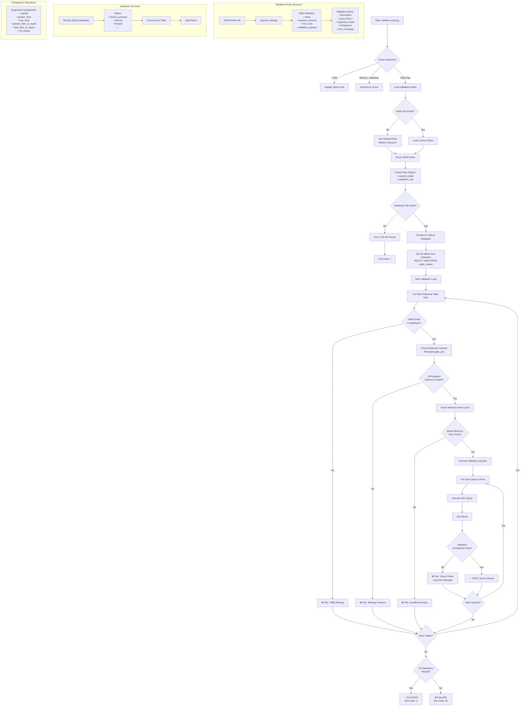

# ROCpd Validation Flow

## Input Phase

- Takes a ROCpd database file (.db) as input
- Optionally accepts custom validation rules (JSON file)
- Uses default rules if no custom rules provided

## Validation Rules Structure

- JSON-based configuration with required tables
- Each table has:
  - Required columns to check for
  - Minimum row count requirements
  - Custom SQL validation queries

## Validation Process

- For each required table, the tool:

  - Checks table existence in the database
  - Verifies required columns are present
  - Validates minimum row count
  - Executes custom SQL queries with various comparison operations

## Output & Results

- Real-time feedback with ✅/❌ indicators
- Detailed error messages for failures
- Exit codes:
  - **0**: All validations passed
  - **65**: Validation failures
  - **1**: General errors (file not found, etc.)
